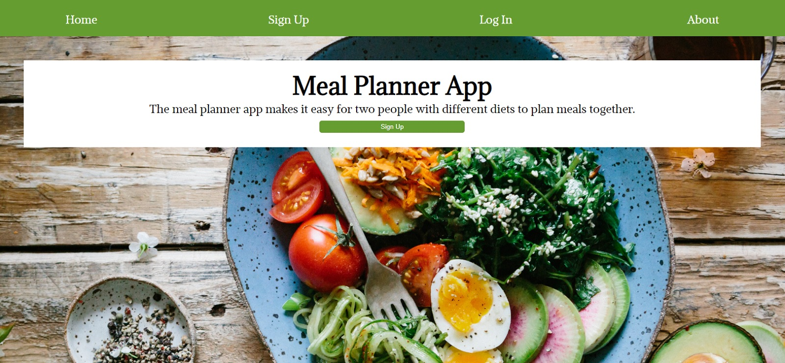
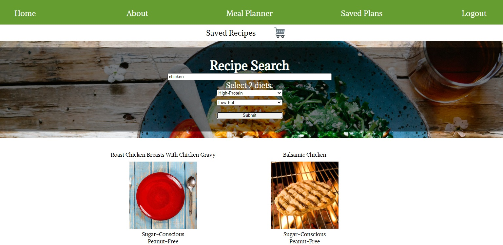

# Meal Planner App

## About
The meal planner app is a full stack application that helps two people find recipes that suit two different diets and plan their meals. Upon creating an account, the user is able to search for recipes and save these recipes to their own customized meal plans. The app uses Edamam's recipe API for the recipes and an API built from scratch for user info and saved recipes.

## Live Link
https://meal-planner-app-eight.vercel.app/

## Technologies Used
* HTML
* CSS
* Javascript
* React 
* Node.js
* Express
* PostgreSQL
* RESTful API

## Screenshots 






# API Documentation 

## Base URL
https://boiling-dawn-47143.herokuapp.com"


## Response
* JSON

## Authentication
* Requires JWT token

Each request must include  `content-type: application/json` and `Authorization: Bearer [token]`

## Create New User
* POST /api/users
* Request Body must include: username, first_name, user_password 

## Log In
* POST /api/auth/login
* Request Body must include username, user_password

## Saved Meals

### GET saved meals
* /api/saved-meal-plans to get user's saved meals
* /api/saved-meal-plans/:id to get a mealplan by id

### DELETE user's saved project
* /api/saved-meal-plans/:id to delete a specific meal plan

### POST save a project to user
* /api/saved-meal-plans to save a new meal plan
* must be formatted as an object with 'name' as a string and 'meals' as an array of objects. Each meal must include `meal_image` `meal_url`, and `meal_label` 
* OPTIONAL in each meal are: `dietlabels`, `healthlabels`
* EXAMPLE: 
     ```const meal = { 
         name: 'meal plan',
         meals: [{
             meal_image: 'www.image.com',
             meal_url: 'www.url.com',
             meal_label: 'Lasagna'
          }]
     }```